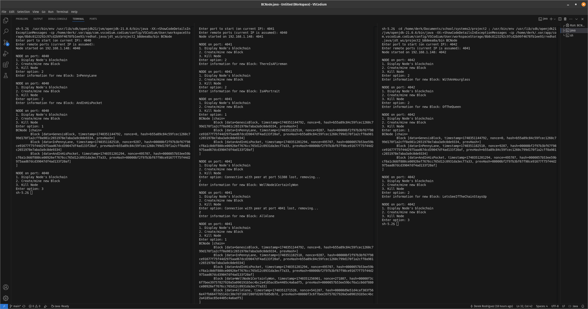

# Simple peer-to-peer blockchain

A **Java implementation** of a p2p proof-of-work blockchain using ports on localhost.

---

## Features
- PoW mining model with configurable difficulty
- Text representation of the current chain
- Distributed nodes using threads and sockets
- Consensus algorithm for newly connecting peers
- Custom String data included in each block
- Block validation/hash checking from peers
- Synchronized methods to prevent race conditions
- Automatic peer list management (peers are removed when disconnected)
- `DEBUG` in `BCNode.java` can be set for detailed debug info

---

## Main
- Main located in `BCNode.java`
- Asks for what port the node should run on, as well as for a list of peer ports
- Creates a ServerSocket to listen for incoming connections and makes socket calls to all peer ports
- Obtains the current chain from given peers, or creates the chain if no peers given

---

## Mining
- Hash-based proof of work model
- Iterates nonce until hash begins with `N` many zeros
- Mined blocks are sent to all peers and added to the chain